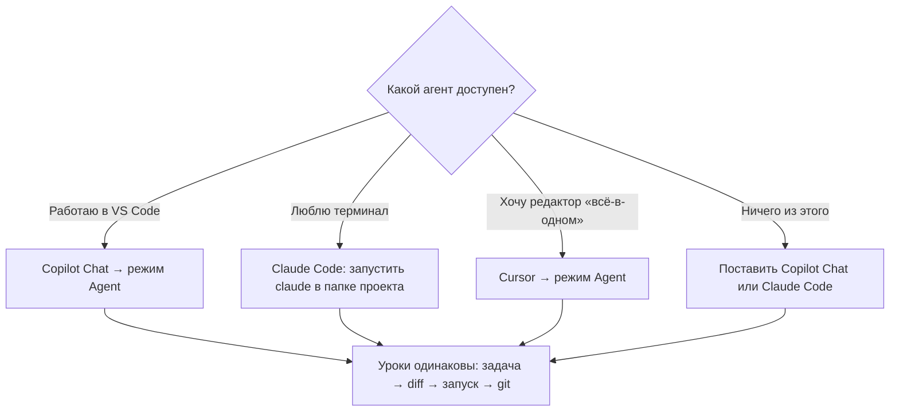
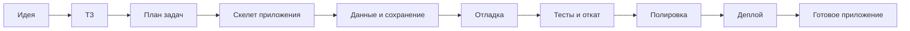

# Vibe Coding без магии

Как с помощью AI собрать настоящее приложение.

**Формат:** текстовый мини-курс · 5 модулей · 14 уроков · 2–3 часа чтения + 4–6 вечеров практики (вечер — это примерно 1–1,5 часа за компьютером).
**Проект курса:** «Пиксель» — виртуальный питомец, который живёт в браузере.
**Стек:** React + Vite + чистый CSS · `localStorage` · деплой на Vercel.

## Кому подходит

- Нужно уметь: открывать терминал и устанавливать программы. Опыт программирования не требуется: код пишет агент, ваша работа — ставить границы, проверять результат и держать рабочую версию в git.
- Понадобится бесплатный аккаунт GitHub (зачем — объяснит урок 5.2).

## Почему курс работает через агента, а не через копи-паст из чата

Чат с копи-пастом — универсальный и бесплатный способ, но он не учит главному: превращать AI в рабочий процесс. Агент живёт в папке проекта, правит файлы, запускает команды — и требует от вас новых навыков: ставить границы, смотреть diff, откатываться в git. Именно эти навыки отличают «поговорил с чатботом» от «собрал приложение». Поэтому курс построен на агенте. Если агента нет — курс можно прочитать и в чате, но большинство заданий придётся адаптировать: файлы будете создавать и запускать вы сами, проверки вроде «сначала план команд» и diff — пропускать. Честно: это половина курса.

## Какой агент выбрать

Всем вариантам ниже для курса нужны три умения: править файлы в папке проекта, запускать команды и показывать изменения — **diff**: список того, что в файле удалено и что добавлено (подробно — в уроке 2.2). Если инструмент умеет только отвечать текстом, — это не агент для этого курса.

| Инструмент | Что это | Когда выбирать | О чём помнить |
|---|---|---|---|
| Copilot Chat, режим Agent | агент внутри VS Code | уже работаете в VS Code и не хотите менять редактор | включите именно режим Agent, а не Ask (переключатель режима — у поля ввода в окне чата; названия пунктов могут отличаться от версии к версии); подтверждение команд должно быть включено (правило 6) |
| Claude Code | агент в терминале (CLI), запускается командой `claude` из корня проекта | вам удобен терминал; задачи длинные и автономные | входит в платные тарифы Claude или оплачивается через API — следите за расходом |
| Cursor | отдельный редактор (сделан из VS Code) со встроенным агентом | хотите «всё-в-одном» и готовы перенести туда свои настройки | настройки и горячие клавиши слегка отличаются от VS Code |
| Другие агентные инструменты (Windsurf, Codex CLI и т. п.) | любой инструмент с файлами, командами и diff | если уже выбраны вами | тот же чек: правит файлы, запускает команды, показывает изменения |

**Как выбрать за минуту:**

1. **Уже есть VS Code и доступ к Copilot** → Copilot Chat в режиме Agent: меньше всего новых сущностей.
2. **Не хотите платить** → бесплатные лимиты Copilot или Cursor; лимиты дисциплинируют — для этого курса скорее плюс.
3. **Любите терминал, задачи длинные** → Claude Code.
4. **Готовы ради агента сменить редактор** → Cursor.
5. **Есть только обычный чат** → вы в фолбэке из абзаца выше; часть практики придётся пропустить.

Что реально отличает инструменты: сколько контекста видит агент, сколько шагов делает без подтверждения и сколько стоит. Навыки курса — границы задачи, diff, откат, проверка поведения — одинаковы везде. Тарифы, названия режимов и лимиты меняются — сверяйтесь с документацией инструмента.

## Правила работы с агентом — на весь курс

1. Агент работает только внутри папки, открытой в редакторе (File → Open Folder). До урока 1.3 это папка курса, где лежат документы (`docs/`); с урока 1.3 — сама папка проекта `pixel-pet`, её нужно открыть заново. Если агент «не находит» файлы — первым делом проверьте, какая папка открыта.
2. Один запрос = одна задача из плана.
3. После каждой правки вы смотрите diff — не принимайте изменения вслепую.
4. Рабочая версия всегда закоммичена в git.
5. Агент может запускать команды — но вы должны уметь повторить их сами.
6. Команды агент сначала показывает, потом выполняет. Проверьте до урока 1.3, что в настройках инструмента включено подтверждение команд: если команды выполняются без спроса — включите подтверждение, иначе правило не работает.
7. Секреты и ключи — никогда в коде. В этом курсе секретов нет; на будущее: во фронтенде всё, что попало в сборку (в том числе переменные окружения с префиксом `VITE_`), видно всем — настоящие секреты живут только на сервере. И никогда не отправляйте агенту в чат токены и пароли.
8. Практика — это расширение проекта. Если после практики появилось что-то сверх базового варианта (третья шкала, кнопка сброса, ускоренный спад) — либо распространите на это правила следующих уроков, либо вернитесь к базовому варианту до конца модуля. Иначе вы будете спорить с чеклистами.

## Маршрут курса

## Карта модулей

| Модуль | Уроки | Файлы |
|---|---|---|
| 1. От идеи к плану | 1.1–1.3 | [1.1](модуль-1-от-идеи-к-плану/1.1-идея-в-тз.md) · [1.2](модуль-1-от-идеи-к-плану/1.2-декомпозиция.md) · [1.3](модуль-1-от-идеи-к-плану/1.3-настройка-проекта.md) |
| 2. От плана к скелету | 2.1–2.3 | [2.1](модуль-2-от-плана-к-скелету/2.1-первый-экран.md) · [2.2](модуль-2-от-плана-к-скелету/2.2-данные.md) · [2.3](модуль-2-от-плана-к-скелету/2.3-время-и-эмоции.md) |
| 3. Отладка без рулетки | 3.1–3.3 | [3.1](модуль-3-отладка-без-рулетки/3.1-ошибки.md) · [3.2](модуль-3-отладка-без-рулетки/3.2-изоляция-проблемы.md) · [3.3](модуль-3-отладка-без-рулетки/3.3-объяснение-кода.md) |
| 4. Страховка | 4.1–4.2 | [4.1](модуль-4-страховка/4.1-тесты.md) · [4.2](модуль-4-страховка/4.2-правки-без-страха.md) |
| 5. Доводка и выпуск | 5.1–5.3 | [5.1](модуль-5-доводка-и-выпуск/5.1-полировка.md) · [5.2](модуль-5-доводка-и-выпуск/5.2-деплой.md) · [5.3](модуль-5-доводка-и-выпуск/5.3-шпаргалка.md) |

## Как устроен урок

Каждый урок: зачем это нужно → что делаем → шаги → готовый промпт для агента → что может пойти не так → чеклист проверки → самостоятельная практика → главное.

Урок считается пройденным только когда выполнен чеклист. Чтение без выполнения — не прохождение.
