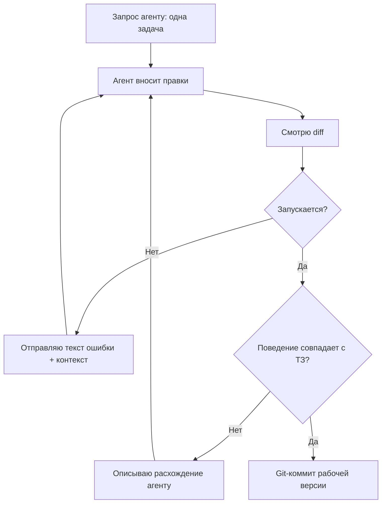

# Урок 2.1. Первый экран: минимум кода, максимум результата

## Зачем это нужно

Самый частый провал новичка — «сделай мне приложение» одним запросом. В ответ приходит простыня кода, внутри которой почти наверняка есть ошибка, — и искать её вы будете в коде, который не читали. В опросе Stack Overflow 2025 главная фрустрация разработчиков — «решения, которые почти правильные, но не совсем» (66%). Чем больше кода за один запрос, тем выше шанс такой ошибки. Поэтому: один запрос = одна задача из плана.

## Что мы делаем

Генерируем первый экран «Пикселя»: питомец-эмодзи, показатели сытости и настроения, кнопки «покормить» и «поиграть», которые меняют числа на экране. Сохранение — в уроке 2.2, спад и эмоции — в уроке 2.3. В курсе это первая задача плана (если ваша нумерация другая — важна суть, а не номер).

## Шаг 1. Соберите контекст для агента

Агент видит только папку проекта и ваши сообщения — он не читал ваш план и не знает границ. Перед запросом зафиксируйте: стек (React + Vite + чистый CSS), границы (только первая задача), файлы (`App.jsx` и `App.css`), критерий готовности (запускается без дополнительных установок). Это не «промпт-магия»: это устранение неоднозначности, за которую иначе вы заплатите ошибками.

## Шаг 2. Отправьте команду и посмотрите diff

Вставьте промпт ниже, заменив `[ПЕРВАЯ ЗАДАЧА ИЗ ПЛАНА]`. Агент внесёт правки в файлы. Не принимайте вслепую: откройте diff изменений (в редакторе или `git diff`) и ответьте себе: это вообще то, что я просил? Нет ли таймеров, сохранения и прочего «заодно»?

## Шаг 3. Проверьте поведение, а не код

Запустите приложение и покликайте кнопки. Числа меняются? Перезагрузка не роняет приложение? (Счётчики могут сброситься — нормально до урока 2.2.) Если не запускается — отправьте агенту текст ошибки с ответами на два вопроса: «что я делал» и «что ожидал». Если запустилось, но ведёт себя не так — опишите расхождение словами и попросите одно исправление. Этот цикл — главный навык курса:



## Prompt

```
Работай в этом проекте (React + Vite + чистый CSS).

Задача: [ПЕРВАЯ ЗАДАЧА ИЗ ПЛАНА, например: «Экран с
питомцем-эмодзи, двумя показателями (сытость, настроение)
и кнопками "покормить" и "поиграть". Клик по кнопке
увеличивает соответствующий показатель на 10».]

Требования:
1) только то, что в задаче, ничего сверх неё;
2) без дополнительных библиотек;
3) весь код — в App.jsx и App.css, новых файлов не создавай;
4) сначала перечисли файлы, которые изменишь, затем внеси
изменения;
5) после правок запусти сборку (npm run build) и покажи
результат: ошибок быть не должно. Поведение в браузере
я проверю сам.

Не добавляй сохранение, таймеры и тесты.
```

Место `[ПЕРВАЯ ЗАДАЧА ИЗ ПЛАНА, например: ...]` замените формулировкой из своего `docs/plan.md`. Пример в скобках — образец, а не обязательный текст.

## Что может пойти не так

1. **«Почти правильный» код.** Пропущенный импорт, выдуманное свойство, опечатка. Почему: модель предсказывает правдоподобный код, а не проверяет его — она не запускала то, что выдала. Поэтому в промпте требование «запусти и убедись», но помните: слова агента «всё компилируется» — утверждение, а не факт. Перепроверяйте своим запуском.
2. **Раздувание.** Агент добавляет таймеры, сохранение и анимации «заодно». Почему: та же причина, что в уроке 1.1 — правдоподобное продолжение задачи получается полным, а не минимальным. Для вас это лишние места для ошибок. Лишнее вырезайте сразу.
3. **Устаревший синтаксис React.** Агент может принести код из старых туториалов: например, переписать `main.jsx` на `ReactDOM.render(...)` вместо `createRoot` (в React 19 такого API уже нет). Почему: «как писали раньше» для модели неотличимо от «как пишут сейчас». Признак: ошибка в терминале или браузере с указанием на конкретную строку. Покажите её агенту и попросите убрать только то, на что она указывает; если ошибка вернётся — сверьте замену с актуальной документацией React.

## Как проверить результат

- [ ] В браузере виден питомец-эмодзи.
- [ ] Клик «покормить» увеличивает сытость.
- [ ] Клик «поиграть» увеличивает настроение.
- [ ] В консоли браузера (F12 → Console) нет ошибок.
- [ ] Новых файлов и функций сверх задачи не появилось.
- [ ] Перезагрузка страницы не роняет приложение.

## Практика

Добавьте третью кнопку — «спать»: увеличивает показатель «энергия» на 10. Правила: сначала письменно зафиксируйте поведение, затем тот же промпт с добавлением требования «не переписывай файл целиком, покажи точечные изменения», затем проверьте кликами все три кнопки. Считается выполненным, когда новая кнопка работает, старые не сломаны, лишнего кода нет. Готового решения нет: цикл «запрос → diff → запуск → исправление» и есть навык.

Если вы сделали эту практику, у вас появилась третья шкала. В остальном курсе участвуют две (спад в 2.3, тесты в 4.1, полировка в 5.1 говорят о сытости и настроении), поэтому решите осознанно: либо распространяйте каждое новое правило и на «энергию», либо перед модулем 3 уберите её и вернитесь к двум шкалам. Забытая практика — источник путаницы в чеклистах.

## Главное

1. Один запрос = одна задача из плана.
2. Неоднозначность промпта — ваша цена за ошибки агента.
3. Агент предсказывает код, а не проверяет его: правда одна — запуск и поведение.
4. «Всё компилируется» от агента — утверждение, а не факт. Проверьте сами.
5. Текст ошибки — данные для исправления. «Не работает» — не данные.
6. Лишняя фича от агента — техдолг, а не подарок. Вырезайте.
7. Маленький работающий экран ценнее простыни, которая не запускается.
