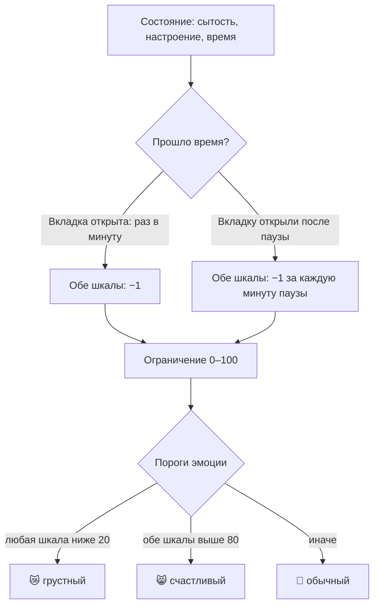

# Урок 2.3. Время и эмоции: питомец становится живым

## Зачем это нужно

Сейчас «Пиксель» живёт по кликам: кормите — растёт, играете — растёт. Между кликами не происходит ничего — и это сразу выдаёт демо: питомец, который меняется только от кнопок, это счётчик, а не питомец. Настоящий теряет силы сам. Спад показателей — первая функция, которая работает без пользователя, и первый таймер в проекте. Таймеры — классическое место багов «работает, но не так»: таймеров оказалось два — и спад идёт вдвое быстрее; спад тикает только пока вкладка открыта; эмодзи «залип» и не меняется. Поэтому этот урок — тот же цикл «задача → diff → проверка», но на самой коварной задаче проекта.

## Что мы делаем

Три связанные вещи:

1. **Границы.** Сытость и настроение живут в диапазоне 0–100: десять кормёжек подряд не дают 150, а бесконечный простой не уводит в минус.
2. **Спад.** Каждую минуту обе шкалы уменьшаются на 1. Причём честно: если вкладку закрывали на 10 минут, при открытии спад начислится и за это время.
3. **Эмоции.** Эмодзи питомца отражает состояние: 😿 — если любая шкала ниже 20, 😸 — если обе выше 80, 🙂 — в остальных случаях.



В курсе это третья задача плана (если ваша нумерация другая — важна суть). Как всегда: без новых библиотек, весь код — в `App.jsx` и `App.css`.

## Шаг 1. Сформулируйте поведение и способы проверки

До промпта сверьтесь: как вы это проверите? Ниже — готовые способы; если видите другой путь, допишите свой.

- **Границы:** кликаю «покормить» десять раз — сытость останавливается на 100, не ползёт дальше.
- **Спад на глазах:** записываю значения, оставляю вкладку открытой на 3–4 минуты — обе шкалы уменьшились примерно на 3–4.
- **Спад в «офлайне»:** записываю значения, закрываю вкладку, открываю через 5 минут — значения уменьшились примерно на 5.
- **Эмоция:** довожу сытость до 15 — эмодзи сменился на грустный; поднимаю обе шкалы выше 80 — на счастливый.

Если проверки не сформулированы — вы не отличите «работает» от «работает наполовину». А это как раз то, как выглядит главный баг этого урока: спад, который тикает не так, как ожидалось.

## Шаг 2. Отправьте промпт и посмотрите diff

Промпт ниже. Обратите внимание на непривычные требования: «таймер — один», «посчитать время отсутствия», «тесты не добавлять». Первое — защита от классического бага с двумя интервалами, второе — то, что отличает честный спад от «тикает, пока открыто», третье — потому что тесты у нас будут в модуле 4, не раньше.

После правок посмотрите diff: не появились ли новые компоненты, анимации или библиотеки, которых вы не просили. Заодно проверьте, что не появилось новых файлов: весь код этого урока — в `App.jsx` и `App.css`.

## Шаг 3. Проверьте поведение руками

Чувствительное место — время и значения в хранилище. Прежде чем проверять, **очистите сохранённое состояние**: F12 → Application → Local Storage → адрес приложения → правый клик по строке с состоянием питомца → Delete (или кнопка Clear). Иначе в хранилище лежат данные из урока 2.2, в которых нет отметки времени, — и первый же запуск может дать `NaN` или резкое падение шкал не из-за бага, а из-за старых данных.

### Как менять значения и отметку времени руками

Это ваш основной инструмент в этом уроке: большинство проверок требует быстро понизить шкалу, а спад идёт всего −1 в минуту, то есть ждать пришлось бы час.

1. F12 → вкладка **Application** → раздел **Local Storage** → адрес приложения (`http://localhost:5173`).
2. В списке ключей найдите состояние питомца. Имя ключа выбирал агент (в 2.2 вы его записали); значение — **одна строка JSON**, например `{"satiety":78,"mood":70,"lastUpdate":1758...}`.
3. Двойной клик по значению открывает его для правки. Меняйте осторожно: лишняя кавычка или запятая ломают JSON.
4. **Сначала запишите исходное значение** (скопируйте в блокнот) — чтобы вернуть, если что-то испортится.
5. **Отметка времени** (может называться `lastUpdate`, `updatedAt`, `timestamp`) обычно хранится числом — миллисекунды от 1 января 1970 года. 10 минут — это 600000, час — 3600000. Чтобы сымитировать паузу, **вычтите** из отметки нужное число и перезагрузите страницу: приложение посчитает, что прошло больше времени, и спишет спад за эти минуты. Отметка должна стать **старше** текущего времени, но не позже — иначе спад пойдёт «в минус» или получится странный результат. Если вместо числа у вас читаемая дата — вычитайте минуты из неё.
6. Приложение считает так: при загрузке оно сравнивает сохранённое время с текущим и начисляет спад за разницу. Именно поэтому правка отметки и есть проверка «офлайна».
7. Если после правки приложение сломалось или показывает странности — нажмите **Clear** (или удалите ключ), перезагрузите страницу и начните заново. Это не поломка проекта: состояние — не код, его всегда можно создать заново.

Не хотите возиться с DevTools — работает и честное ожидание: закройте вкладку на 5 минут и откройте снова.

### Проверки

1. **«Офлайн»:** запишите значения, уменьшите отметку времени на 600000 (10 минут), перезагрузите — значения должны упасть примерно на 10.
2. **Спад на глазах:** оставьте вкладку **активной** на 3–4 минуты, не переключаясь на другие вкладки и не закрывая крышку ноутбука (браузер тормозит таймеры в фоновых вкладках, и падение будет меньше ожидаемого — это не баг агента). Падение должно быть ≈1 в минуту. Если вдвое-втрое быстрее — у агента «двойной таймер» (частая ошибка React). Если спад пропал совсем — тоже смотрите на таймер: при починке двойного его легко убить целиком.
3. **Эмоция через пороги туда-обратно:** занизьте сытость ниже 20 в хранилище (и перезагрузите) → грустный; откормите кнопками так, чтобы обе шкалы были выше 80 → счастливый; затем понизьте одну — снова обычный. Если эмодзи «залип» — эмоция вычисляется один раз при загрузке, а не при каждом изменении.
4. **Границы с двух сторон:** сверху — сто́п на 100; снизу — поставьте шкале значение 1–2 и подождите минуту (или вычтите из отметки времени больше минут) — ниже 0 значение не уходит.

Нашли несоответствие — это данные для агента: описываете «что делал → что увидел → что ожидал» и просите одну правку. После проверок закоммитьте рабочую версию:

```
git add .
git commit -m "спад по времени, границы и эмоции"
```

## Prompt

```
Работай в этом проекте (React + Vite + чистый CSS).

Задача: питомец должен меняться сам и показывать эмоцию.

Требования:
1) сытость и настроение ограничены: не меньше 0 и не больше 100;
2) раз в минуту обе шкалы уменьшаются на 1;
3) время последнего обновления храни вместе с состоянием
в localStorage; когда страницу открывают — посчитай, сколько
минут прошло, и начисли спад за это время. Если сохранённых
данных нет или в них нет отметки времени — начни со стартовых
значений; в шкалах не должно появиться NaN или undefined;
4) эмоция зависит от шкал: 😿 — любая ниже 20; 😸 — обе выше 80;
🙂 — в остальных случаях. Эмоция вычисляется из шкал при каждом
изменении, отдельным полем не хранится;
5) таймер должен быть один и корректно очищаться. Если в шаблоне
включён Strict Mode (посмотри main.jsx) — в режиме разработки
эффекты запускаются дважды: ни спад по таймеру, ни спад,
начисленный при загрузке за пропущенное время, не должны
удваиваться;
6) если у меня есть кнопка сброса состояния — сброс должен
сбрасывать и отметку времени;
7) покажи точечные изменения: файл целиком не переписывай,
новых файлов не создавай, весь код — в App.jsx и App.css;
8) только то, что в задаче: новых кнопок, анимаций, библиотек
и тестов не добавляй;
9) сначала перечисли файлы, которые изменишь, затем внеси
изменения;
10) после правок запусти сборку (npm run build) и покажи
результат — ошибок быть не должно; поведение я проверю сам.
```

## Что может пойти не так

1. **Двойной таймер.** Спад идёт вдвое быстрее: за 4 минуты упало на 8. Почему: в React легко создать второй интервал, не убрав первый; в режиме разработки Strict Mode специально запускает эффекты дважды, чтобы такие ошибки были видны. Тот же Strict Mode может удвоить и спад, начисленный при загрузке за время отсутствия: если после правки отметки времени значения упали вдвое больше ожидаемого — дело в нём. Что делать: покажите агенту факт («за 4 минуты упало на 8, ожидал на 4») — это точнее, чем просьба «почини таймеры».
2. **Спад без «офлайна».** Закрыли вкладку на 10 минут — при открытии ничего не изменилось: значения тикают, только пока страница открыта. Почему: это самый простой способ написать таймер — и модель выберет его, если не требовать обратного. Что делать: пункт 3 промпта + ваша проверка с закрытой вкладкой (или через отметку времени в Local Storage).
3. **«Залипшая» эмоция.** Шкалы меняются, эмодзи — нет. Почему: эмоцию легко вычислить один раз при загрузке и не пересчитывать при изменениях. Что делать: занизьте сытость до 15 в хранилище, затем откормите до 85 и попросите точечную правку.
4. **Спад пропал совсем.** После «починки» двойного таймера значения не меняются вовсе. Почему: агент убрал таймер, а не его дубликат, или очистка срабатывает сразу после запуска. Что делать: тот же факт агенту — «за 4 минуты не упало ни на сколько».
5. **После перезагрузки шкалы упали слишком сильно.** Открыли приложение — значения рухнули на десятки. Почему: в сохранённых данных была старая отметка времени (или её не было вовсе), и агент посчитал спад за всё это время. Что делать: очистите хранилище (Clear) и проверьте сценарий заново на чистых данных; если повторяется — покажите агенту, что отметка не обновляется при сохранении.

## Как проверить результат

- [ ] Перед проверками хранилище очищено (Clear); после очистки приложение открывается в стартовых значениях, без `NaN` и `undefined`.
- [ ] Сытость и настроение не выходят за границы 0–100 — проверено с двух сторон.
- [ ] За 3–4 минуты с открытой вкладкой падение ≈1 в минуту (не быстрее).
- [ ] Пауза с закрытой вкладкой засчитана: при открытии значения уменьшились примерно на число прошедших минут.
- [ ] 😿 появляется при любой шкале ниже 20, 😸 — при обеих выше 80, 🙂 — в остальных случаях; проверено кликами через пороги туда-обратно.
- [ ] В консоли браузера нет ошибок; в diff нет лишнего кода.
- [ ] Есть git-коммит рабочей версии.

## Практика

Добавьте правило «сытый не грустит»: настроение не уменьшается, пока сытость выше 50. Сначала сформулируйте проверку (как вы увидите разницу за пару минут?), затем — точечная правка тем же промптом, затем проверка руками. Задание без готового решения.

Самопроверка: занизьте сытость до 30 (в хранилище, затем перезагрузите) — спад настроения возобновился; поднимите выше 50 — спад настроения остановился.

Чтобы увидеть разницу за пару минут, спад обычно приходится ускорить: попросите агента временно заменить интервал на 5 секунд. Это нормальный приём — но **верните обычный спад сразу после проверки** и убедитесь, что снова −1 в минуту: ускоренный спад, забытый в проекте, сломает проверки в модулях 4–5.

## Главное

1. Живое приложение меняется без пользователя — именно это отличает питомца от счётчика кликов.
2. Таймер — первый код, который работает сам; его баги выглядят как «правильно, но с другой скоростью».
3. Честный спад считают по реально прошедшему времени: пока вкладка открыта — по таймеру, после паузы — по отметке времени. Иначе спад «тикает, только пока открыто».
4. Эмоция — это функция от показателей: скоро такие функции вы будете проверять тестами (модуль 4).
5. Одна правка за раз: пока не проверили спад — не трогайте эмоции.
6. Двойной спад, пропавший «офлайн» и залипшая эмоция — типовые баги этого урока; теперь вы знаете, как их ловить.
