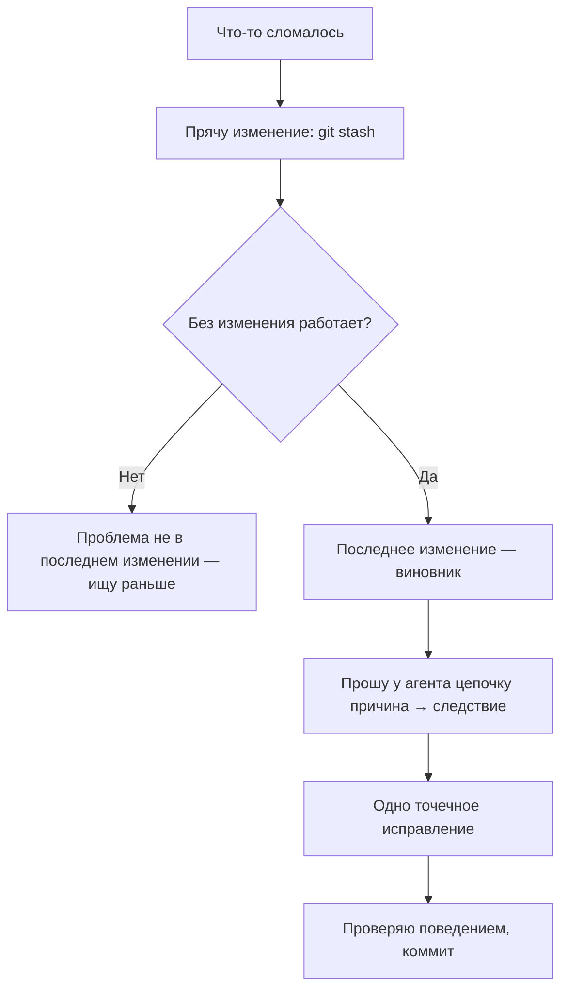

# Урок 3.2. Изолируем проблему: одна переменная за раз

## Зачем это нужно

Классическая ситуация: вы попросили агента об одном, а после правок сломалось два места, и непонятно, виновата ли правка вообще. Если не изолировать проблему, следующий запрос будет «что-то сломалось, почини всё» — и вы вернётесь в рулетку из урока 3.1. Изоляция — это метод: подозреваемый номер один — последнее изменение, и проверить его можно откатом.

## Что мы делаем

Ломаем приложение изменением, подтверждаем откатом в git, что виновато именно оно, и просим у агента причинно-следственную цепочку и одно точечное исправление. Ключевой навык — откат как инструмент диагностики, а не как «отмена».

## Шаг 1. Зафиксируйте рабочую версию

Сделайте git-коммит, если рабочая версия ещё не закоммичена. Без этого откат невозможен, а без отката нет эксперимента. Затем внесите в код изменение, которое ломает одну кнопку — рецепт из урока 3.1: замените имя обработчика в одном месте (например, `handleFeed` на `handleFeed2`), не меняя его в другом, или удалите строку `import`.

## Шаг 2. Подтвердите гипотезу откатом

Проверьте, что кнопка сломана. Теперь «спрячьте» изменение, не теряя его: выполните `git stash -u` — рабочая версия вернётся, а правка останется в запасе. `-u` нужен, чтобы спрятались и новые файлы: без него `git stash` их не трогает, и вывод эксперимента будет неверным. Убедитесь, что `git status` стал чистым, и проверьте кнопку. Снова работает? Значит, виновник — именно ваше изменение, а не «что-то в проекте». Кажется очевидным, но именно этот шаг пропускают — и дальше ищут проблему в случайных местах. (Другой путь — `git restore файл`: откатит сильнее, но ломающую правку придётся внести заново.)



## Шаг 3. Верните изменение и получите цепочку причин

Верните изменение на место (`git stash pop`) и отправьте агенту промпт ниже. В ответе должна быть цепочка «причина → следствие» и одно исправление. Примените, проверьте кнопку, закоммитьте. Если агент предложил несколько правок сразу — отклоните и попросите одну.

## Prompt

```
Кнопка [X] перестала работать после того, как я изменил [Y].
Когда я откатываю файл в git — всё снова работает.

1) Объясни цепочку «причина → следствие»: что именно в
изменении [Y] сломало [X].
2) Предложи одно точечное исправление и внеси его.
3) Запусти сборку и покажи, что ошибок нет; работу [X] я проверю сам.

Больше ничего не меняй.
```

## Что может пойти не так

1. **Пакет из 3–4 «возможных» исправлений.** Агент перечисляет версии, потому что не имеет данных, какая верна, и хочет закрыть вопрос наверняка. Но если применить всё сразу, вы не узнаете, что было причиной, — и не научитесь видеть эту ошибку в будущем. Применяйте по одной.
2. **Агент «исправляет» не то место.** Без информации об откате он чинит по своей догадке: например, добавит проверку в компоненте, хотя проблема в обработчике. Поэтому и важно сообщить: «откатываю — работает, возвращаю — ломается»; это сужает виновника до конкретного изменения.

## Как проверить результат

- [ ] Рабочая версия была закоммичена до эксперимента.
- [ ] Сломанная кнопка заработала после отката, `git status` после stash был чистым.
- [ ] После возврата изменения проблема воспроизвелась.
- [ ] Агент дал цепочку «причина → следствие», которую вы повторяете своими словами.
- [ ] Исправление одно, кнопка работает, остальное не тронуто, есть коммит.

## Практика

Внесите два независимых изменения в **разные файлы**: одно ломает кнопку «покормить» (например, в `App.jsx`), другое ничего не ломает (например, текст или цвет в `App.css`). Так виновника можно проверять по одному: `git stash push src/App.jsx` спрячет только одно изменение, а второе останется на месте — одному `git stash` это не под силу, он прячет всё сразу.

Порядок: сначала гипотеза (какое изменение виновно и почему), потом проверка по одному файлу, и только после вывода — сверка с тем, что вы вносили. Задание без готового решения, но с ограничением: агенту можно отправлять только факты («откат изменения А чинит проблему»), а не просьбы «почини». Цель — чтобы метод отката работал в ваших руках, а не в руках агента.

## Главное

1. Последнее изменение — первый подозреваемый.
2. Откат в git — это эксперимент, а не капитуляция.
3. «Откатываю — работает» — сильнейший факт для агента.
4. Одна правка за раз, даже если агент предлагает три.
5. Цель — понимать причину, а не просто вернуть зелёный экран.
