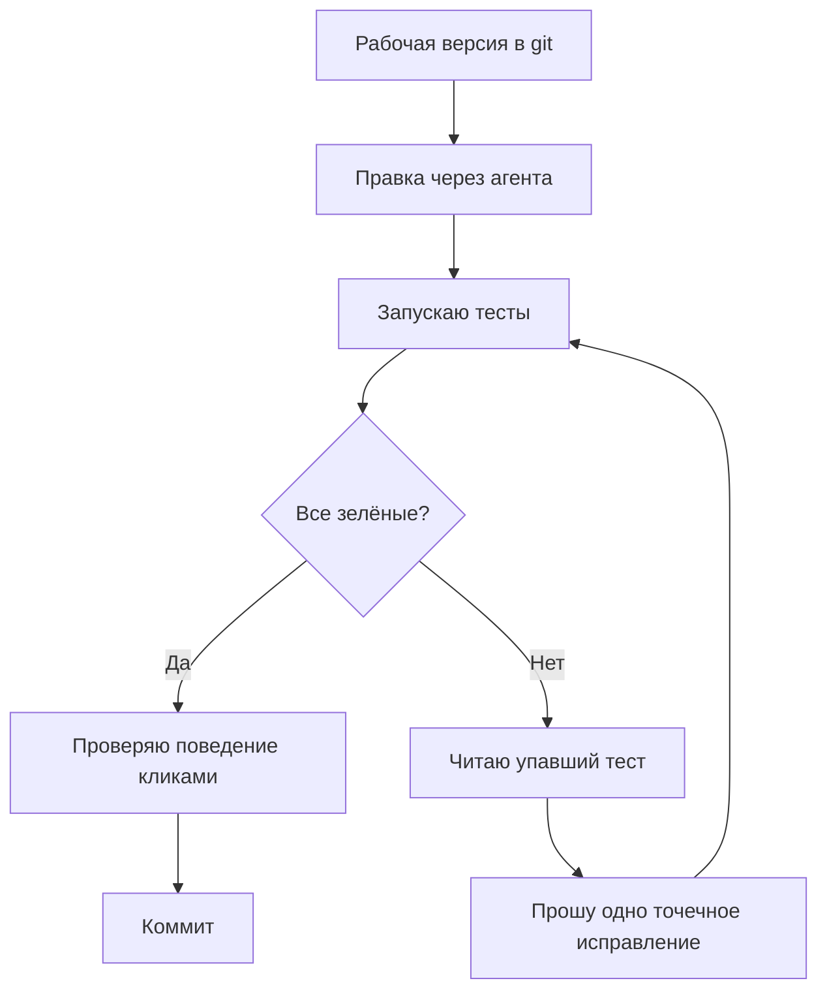

# Урок 4.2. Правки без страха: тесты + git

## Зачем это нужно

Страх менять код — не черта характера, а следствие отсутствия страховки: вы не знаете, что сломали, пока не сломали. С тестами и git правка перестаёт быть прыжком в темноту: изменили → запустили тесты → красный? откат или точечное исправление → зелёный? коммит. На этом уроке цикл проходится целиком, с агентом в роли исполнителя правок.

## Что мы делаем

Вносим осознанную правку в логику питомца (например, меняем награду за игру), проходя полный цикл: агент предупреждает о последствиях → вносит правку → тесты → поведение → коммит.

## Шаг 1. Попросите сначала предсказать последствия

До кода — анализ. Промпт ниже: агент сначала перечисляет, какие части приложения затронет правка и какие тесты могут упасть. Сравните его список со своим пониманием. Если агент говорит «ничего не затронет», а правка меняет награду, которую проверяет тест, — агент ошибся, и полезно узнать это до правки.

## Шаг 2. Примените правку и посмотрите diff

Пусть агент внесёт изменение минимальным способом. Посмотрите diff: правка должна касаться только того, о чём договаривались. Если агент по пути «починил» стили или переименовал переменные — верните его к задаче.

## Шаг 3. Прогоните тесты и закройте цикл

Запустите тесты сами. Зелёные? Проверьте поведение в браузере: награда изменилась именно так, как хотели. Затем коммит. Если красные — сначала решите, кто прав: тест или новое требование? Требование изменилось осознанно — попросите агента точечно поправить **тест** и объяснить, что изменилось в контракте поведения; логику в этой правке трогать нельзя (в уроке 4.1 это было красным флагом). Тест прав — попросите у агента одно исправление и повторите цикл. Решение принимаете вы, не агент. Падающий тест — это успех страховки, а не провал.



## Prompt

```
Я хочу изменить: [ОПИСАНИЕ ПРАВКИ, например: «награда за игру
с +10 на +15, только для игры, кормление не трогать»].

1) Сначала перечисли, какие части приложения это затронет
и какие тесты могут сломаться.
2) Затем внеси правку минимальным способом.
3) Запусти тесты и покажи результат.

Не добавляй новых функций и не чини то, что не связано
с правкой.
```

## Что может пойти не так

1. **Забывает связанное.** Изменил награду за игру — и не обновил условие «питомец счастлив при показателях выше 80». Почему: агент видит текст кода, а не связи между его частями; связи, не названные в задаче, для него не существуют. Вас спасают тесты: упавший тест покажет связь, которую вы оба упустили.
2. **Правка «заодно».** Агент расширяет задачу: «я заодно переименовал обработчик, так понятнее». Почему: модели обучены быть полезными, а «полезность» не знает слова «границы». Каждое «заодно» — лишнее место для бага и лишний шум в diff. Отклоняйте и просите только согласованное.
3. **Правка внесена до предсказания.** Агент пропустил первый пункт и сразу изменил код. Что делать: откатите изменение (`git restore src/App.jsx` для одного файла или `git restore .`, если больше ничего не меняли) и отправьте запрос заново — первым сообщением только список последствий, а саму правку просите отдельным шагом.

## Как проверить результат

- [ ] Агент предсказал последствия до правки, и вы сравнили со своим пониманием.
- [ ] Diff содержит только согласованное изменение.
- [ ] Тесты запущены вами, результат виден вам, не со слов агента.
- [ ] Поведение в браузере соответствует задуманному.
- [ ] Рабочая версия закоммичена.

## Практика

Измените формулу спада: вместо «−1 в минуту» — «−2 в минуту». Задание без готового решения. Обязательные условия: сначала список последствий от агента, потом правка, потом вы сами прогоняете тесты. Если упал тест, которого вы не ожидали, — не просите агента «починить всё»: прочитайте тест и решите, кто прав — тест или новое требование.

В конце верните «−1 в минуту» (и тест обратно), если не решили осознанно оставить «−2» как новое требование: в модуле 5 курс подразумевает исходный спад.

## Главное

1. Страх менять код лечится страховкой, а не смелостью.
2. Предсказание последствий до правки экономит часы после неё.
3. Красный тест задаёт вопрос «кто прав» — отвечайте сами, до правки.
4. «Заодно» в правке — красный флаг, а не сервис.
5. Тесты запускаете вы, коммитите вы — агент только исполняет.
