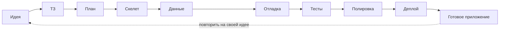

# Урок 5.3. Закрытие: ваша шпаргалка и следующий проект

## Зачем это нужно

Ценность курса — не «Пиксель», а процесс, который вы теперь можете повторить на любой идее. Если не зафиксировать процесс, он испарится вместе с деталями уроков: через месяц вы вспомните «что-то про диффы и тесты», но не последовательность. Этот урок превращает опыт в инструмент: одна страница, которую вы реально будете открывать.

## Что мы делаем

Описываем свой процесс своими словами, просим агента свести его в чеклист и персонализировать вопросами, затем готовим заготовку следующего проекта — новый spec по методике урока 1.1. Весь путь выглядит так:



## Шаг 1. Опишите процесс своими словами

До агента — вы. Напишите свои шаги так, как делали их сами: от «сформулировал идею» до «отправил обновление и проверил опубликованную ссылку». Обычно получается 7–11 шагов (в маршруте курса этапов девять, но у вас часть шагов может слиться в один или наоборот). Пишите своими словами, со своими запинками; черновик сохраните в `docs/moi-shagi.md` — из него вы вставите текст в чат. Если какой-то шаг не можете сформулировать — вернитесь к соответствующему уроку: дыра в описании = дыра в навыке.

## Шаг 2. Сведите в чеклист и персонализируйте

Промпт ниже. Агент сведёт ваши шаги в `docs/cheatsheet.md`, задаст пять личных вопросов и соберёт из ответов правила «когда не просить агента». Отвечайте честно; если агент выдал готовый чеклист, не задав пяти вопросов, — ответьте по темам из промпта сами и попросите дополнить файл. Готовый шаблон из интернета вам не нужен: чеклист ценен ровно тем, что он про вас.

## Шаг 3. Откройте следующий проект

Выберите новую идею (свою, не из курса) и пройдите первый шаг целиком: один абзац идеи → интервью с агентом → spec в `docs` нового проекта. Создайте для него отдельную папку и откройте её в редакторе (File → Open Folder) — агент работает только внутри открытой папки, иначе spec уедет в проект «Пикселя». Не начинайте код — только spec. Это проверка, что урок 1.1 работает без курса за спиной.

## Prompt

```
Я прошёл такой процесс разработки:
[ВАШИ 7–11 ШАГОВ СВОИМИ СЛОВАМИ]

Составь по нему одностраничный чеклист для повторения на
следующем проекте и сохрани его в docs/cheatsheet.md.

Затем задай мне пять вопросов по темам: какие ошибки я делал,
что заняло больше всего времени, что я проверял руками,
какой промпт сработал лучше всего, где агент меня удивил
(в плохом смысле).

Из моих ответов добавь в чеклист раздел «Когда не просить
агента» — минимум три правила.

Отдельным разделом приложи «Шаблоны промптов» — со ссылками
на уроки курса (это справочные заготовки, а не шаги процесса).

Не добавляй в сам процесс пунктов, которых не было в моём
списке шагов.
```

## Что может пойти не так

1. **Универсальный шаблон вместо личного.** На «составь чеклист» без ваших 9 шагов агент сгенерирует красивый список «best practices» из интернета — правдоподобный и бесполезный. Почему: это статистически самый вероятный ответ на такой запрос. Порядок в промпте не случаен: сначала ваш процесс, потом его оформление.
2. **Пункты, которые вы не выполняли.** Агент добавит «настроить CI/CD», которого в вашем процессе не было, потому что «так правильно». Для вашего чеклиста это мусор: пункт, который вы не умеете выполнять, будет только демотивировать. Фраза в промпте «не добавляй пунктов, которых нет в моём процессе» — защита от этого.

## Как проверить результат

- [ ] В `docs/cheatsheet.md` ровно ваш процесс, без чужих пунктов (шаблоны промптов — отдельным разделом).
- [ ] В чеклисте есть раздел «Шаблоны промптов» со ссылками на уроки.
- [ ] В нём минимум три ваших личных правила «когда не просить агента».
- [ ] Вы пересказываете процесс вслух по памяти, не подглядывая в чеклист.
- [ ] Для нового проекта есть spec по методике урока 1.1.

## Практика

Соберите по чеклисту второй мини-проект: spec → план → скелет → деплой. Это задание не на сегодня — это повод вернуться к курсу через неделю-другую. Сроки не важны, важна самостоятельность. Задание без готового решения и без подсказок курса: разрешены только `docs/cheatsheet.md` и ваш агент. Критерий успеха: публичная ссылка и понимание, что в этот раз вы сделали сами, а что делегировали и почему.

## Главное

1. Продукт курса — процесс, а не питомец.
2. Чеклист без вашего вклада — красивая бесполезность.
3. Дыра в описании процесса — дыра в навыке, а не в тексте.
4. Правила «когда не просить агента» важнее списка промптов.
5. Следующий проект — единственный честный экзамен.
